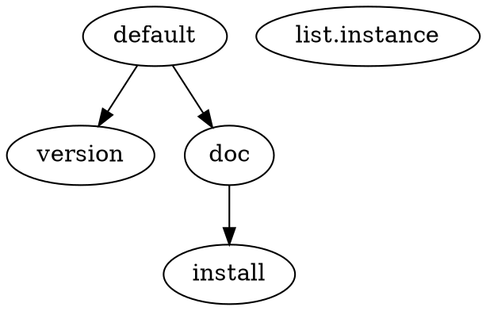
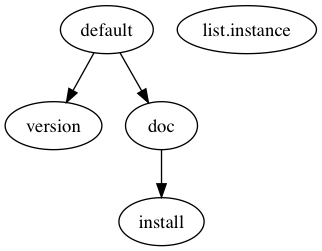

<p align="center"><a href="http://qingcloud.com" target="_blank"></a></p>

# QingCloud Non Official SDK for Go/[GopherLua](https://github.com/yuin/gopher-lua)

[](https://travis-ci.org/chai2010/qingcloud-go)
[](https://hub.docker.com/r/chai2010/qingcloud-go/)
[](https://goreportcard.com/report/github.com/chai2010/qingcloud-go)
[](https://codebeat.co/projects/github-com-chai2010-qingcloud-go-master)
[](https://godoc.org/github.com/chai2010/qingcloud-go)
[](http://docs.qingcloud.com)
[](https://github.com/chai2010/qingcloud-go/blob/master/LICENSE)

Features:

- Go style SDK API
- qcli command line tool, equal SDK
- Base on Protobuf, easy for developer
- Minimize dependence: SDK only depends on Protobuf
- More unit test

Document:

- https://docs.qingcloud.com
- https://godoc.org/github.com/chai2010/qingcloud-go

Mirrors in China:

- https://gitee.com/chai2010/qingcloud-go

spec:

- [api](api)

## qingcloud-go vs [Office SDK API](https://github.com/yunify/qingcloud-sdk-go)

service       | chai2010/qingcloud-go | yunify/qingcloud-sdk-go
------------- | --------------------- | ----------------------
Alarm         | ✓                     | ✗
Hadoop        | ✓                     | ✗
ResourceACL   | ✓                     | ✗
Span          | ✓                     | ✗
Spark         | ✓                     | ✗
S2            | ✓                     | ✗
Other         | ?                     | ?


## `qcli` command line interface

Docker environment:

- `docker run --rm -it -v $HOME:/root -w /root chai2010/qingcloud-go qcli`

Build from source code (Go1.9+):

- `go get github.com/chai2010/qingcloud-go/cmd/qcli`

Or generate version before build:

- `go generate github.com/chai2010/qingcloud-go/pkg/version`
- `go install  github.com/chai2010/qingcloud-go/cmd/qcli`

Enter `qcli` or `qcli -h` command to show help information:

```
chai-mba:api chai$ qcli
NAME:
   qcli - QingCloud Command Line Interface

USAGE:
   qcli [global options] command [command options] [arguments...]

VERSION:
   v0.9.0-33-gbf90580

AUTHOR:
   ChaiShushan <chaishushan@gmail.com>

COMMANDS:
     lake, make  build target with lakefile.lua
     help, h     Shows a list of commands or help for one command

   SDK API Style Command:
     alarm               AlarmService
     cache               CacheService
     cluster             ClusterService
     dnsalias            DNSAliasService
     eip                 EIPService
     hadoop              HadoopService
     image               ImageService
     instance            InstanceService
     job                 JobService
     keypair             KeyPairService
     loadbalancer        LoadBalancerService
     misc                MiscService
     mongo               MongoService
     monitor             MonitorService
     nic                 NicService
     notificationcenter  NotificationCenterService
     rdb                 RDBService
     resourceacl         ResourceACLService
     router              RouterService
     s2                  S2Service
     securitygroup       SecurityGroupService
     snapshot            SnapshotService
     span                SpanService
     spark               SparkService
     subuser             SubuserService
     tag                 TagService
     userdata            UserDataService
     volumes             VolumesService
     vxnet               VxnetService
     zone                ZoneService

GLOBAL OPTIONS:
   --config value, -c value             config file (default: "~/.qingcloud/qcli.json") [$QCLI_CONFIG_FILE]
   --api_server value, -s value         api server (default: "https://api.qingcloud.com/iaas/") [$QCLI_API_SERVER]
   --access_key_id value, -i value      access key id [$QCLI_ACCESS_KEY_ID]
   --secret_access_key value, -k value  secret access key [$QCLI_SECRET_ACCESS_KEY]
   --zone value, -z value               zone (pek3a,pek3b,gd1,sh1a,ap1,ap2a,...) (default: "pek3a") [$QCLI_ZONE]
   --debug, -d                          set debug mode [$QCLI_DEBUG]
   --help, -h                           show help
   --version, -v                        print the version
chai-mba:qingcloud-go chai$
```

We can create a config file (`~/.qingcloud/qcli.json`) for `qcli`:

```json
{
	"api_server": "https://api.qingcloud.com/iaas/",
	"access_key_id": "QYACCESSKEYIDEXAMPLE",
	"secret_access_key": "SECRETACCESSKEY",
	"zone": "pek3a"
}
```

Enter the following command to invoke lake target ([lakefile.lua](lakefile.lua)):

	$ qcli lake -h
	$ qcli lake -t
	$ qcli lake list.instance

Enter the following command to describe instances:

	$ qcli instance DescribeInstances

or plus the `-d` options to enable the debug mode:

	$ qcli -d instance DescribeInstances

*Notes: the `qcli` is work in progress, welcome to give help!*

## Quick Guide (Go Version)

Here is the [./hello.go](./hello.go)'s content:

```go
package main

import (
	"flag"
	"fmt"
	"log"

	"github.com/golang/protobuf/proto"

	pb "github.com/chai2010/qingcloud-go/pkg/api"
	"github.com/chai2010/qingcloud-go/pkg/pbutil"
)

var (
	flagId   = flag.String("id", "", "AccessKeyId")
	flagKey  = flag.String("key", "", "SecretAccessKey")
	flagZone = flag.String("zone", "pek3a", "zone")
)

func main() {
	flag.Parse()

	qnic := pb.NewNicService(&pb.ServerInfo{
		AccessKeyId:     proto.String(*flagId),
		SecretAccessKey: proto.String(*flagKey),
		Zone:            proto.String(*flagZone),
	})

	reply, err := qnic.DescribeNics(nil)
	if err != nil {
		log.Fatal(err)
	}

	s, _ := pbutil.EncodeJsonIndent(reply)
	fmt.Println(s)
}
```

Entern the following command to run exampke:

	go run hello.go -id=QYACCESSKEYIDEXAMPLE -key=SECRETACCESSKEY

The `-id` and `-key` options is for `AccessKey` and `SecretAccessKey`.

The [./pkg/cmd/qcli](./pkg/cmd/qcli) is a complete example.

## Quick Guide ([GopherLua](https://github.com/yuin/gopher-lua) Version)

[hello-lua.go](hello-lua.go):

```go
package main

import (
	"github.com/yuin/gopher-lua"

	qc_iaas "github.com/chai2010/qingcloud-go/pkg/gopher-lua/qingcloud.iaas"
)

func main() {
	L := lua.NewState()
	defer L.Close()

	qc_iaas.Preload(L)

	if err := L.DoFile("hello.lua"); err != nil {
		panic(err)
	}
}
```

[hello.lua](hello.lua):

```lua
local qc = require("qingcloud.iaas")

if #arg == 1 and arg[1] == '-v' then
	print(qc.version)
	print(qc.version_info.git_sha1_version)
	print(qc.version_info.build_date)
	do return end
end

if #arg == 1 and arg[1] == '-h' then
	print(qc.copyright)
	print("hello, 青云!")
	do return end
end

local config = qc.LoadJSON("~/.qingcloud/qcli.json")
local client = qc.Client:new(config)

local reply, err = client:DescribeInstances {
	--owner = "usr-xxxxxxxx",
	zone = "pek3a",
	limit = 100
}
if err ~= nil then
	print("error:", err)
	do return end
end

if reply.ret_code ~= 0 then
	print(reply.ret_code)
	print(reply.message)
	do return end
end

for i = 1, #reply.instance_set do
	local item = reply.instance_set[i]
	print(i,
		item.instance_id,
		item.instance_type,
		item.memory_current..'MB',
		item.status,
		item.create_time,
		item.instance_name
	)
end

print('total: ' .. reply.total_count)
```

Or run with `qlua` command:

	$ go install github.com/chai2010/qingcloud-go/cmd/qlua
	$ qlua hello.lua -h
	$ qlua hello.lua -v
	$ qlua hello.lua

## Quick Guide (`qcli lake` Version)

[lakefile.lua](lakefile.lua):

```lua
task("default", {"version", "doc"}, function()
	print("done")
end)

task("version", nil, function()
	print("version")
end)

task("doc", {"install"}, function()
	print("doc")
end)

task("install", nil, function(task, destdir)
	print("install:", task.name, destdir)
end)
```

Enter the following command to invoke lake target:

	$ qcli lake -h
	$ qcli lake -t
	$ qcli lake
	$ qcli make install[dir=/path/to/dir]

Enter the following command to generate [Graphviz](http://www.graphviz.org/) file:

	$ qcli make -g > lakefile-graph.dot
	$ qcli make -g | dot -Tpng > lakefile-graph.png

[lakefile-graph.dot](lakefile-graph.dot):



[lakefile-graph.png](lakefile-graph.png):

:

## License

The Apache License.
